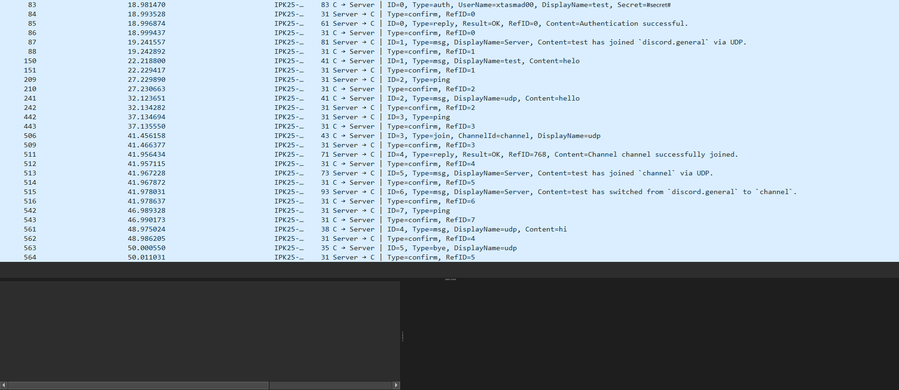

# Documentation for a 2. project for subject IPK: IPK25CHAT
#### Author: Danil Tasmassys, xtasmad00.

---
## Table of Contents

- [1. Description](#1-description)
- [2. Usage](#2-usage)
- [3. Program Structure](#3-structure)
  - [3.1. Main function](#31-main-function)
    - [3.1.1 Argument Parser](#311-argument-parser)
    - [3.1.2 Processing of Interrupt Signal](#312-processing-of-interrupt-signal-c-c)
- [4. Reader](#4-reader)
  - [4.1. Data Class](#41-data-class)
  - [4.2. Finite State Machine](#42-finite-state-machine-)
- [5. Input Check](#5-input-check)
  - [5.1. Clients](#51-clients)
- [6. Error Handler](#6-error-handler)
- [7. Utils](#7-utils-that-were-used)
- [8. Structure of Messages](#8-structure-of-messages)
- [9. Known Limitations](#9-known-limitations)
- [10. Testing](#11-testing)
  - [10.1 Error Scenarios](#101-error-scenarios)
  - [10.2. Graceful Termination of The Communication](#102-graceful-termination-of-the-communication)
  - [10.3. Automated Unit Tests (xUnit)](#103-automated-unit-tests-xunit)
  - [10.4. Servers on python](#104-servers-on-python)
  - [10.4. Other Testing Environments](#105-other-testing-environments)
- [11. Bibliography](#11-bibliography)

## 1. Description
This project is made for subject IPK. 
The project goal is to create the client side application.  
The specification of a project can be found on a NESFIT [[2]](#11-bibliography) gitea.
The project was written on C#. Application only works on `IPv4`

## 2. Usage
`make` - to compilate project.

`./ipk25chat-client`  

`./ipk25chat-client -h` - for help output.

`./ipk25chat-client -t {udp|tcp} -s {server Ip} -p [server port] -d [Udp confrimation timeot] -r [maximum number of UDP retransmissions]`

`make clean` - to delete all unnecessary files after usage.

The notation with braces `{}` is used for required parameters.  
Optional parameters are specified in square brackets `[]`.

Limitations for values of options:
- `-t` - tcp or udp.
- `-s` - IPv4 address or hostname.
- `-p` - 0-65535.
- `-d` - 0-65535.
- `-r` - 0-255.

## 3. Structure
### 3.1. Main function

**Described files:**
- `/Project/Program.cs`
- `/Project/Network/Reader.cs`
- `/Project/Network/InputCheck.cs`
- `/Project/ErrorHandler.cs`
- `/Project/Parser/ArgumentParser.cs`

**Class Diagram:**

- You can check class diagram, where parentheses show difference between overloaded methods.
- Keep in mind that these diagrams are abstract, and they don't show all dependencies, otherwise it will be too complicated and unreadable.

The program starts form the main function (as always).  
The goal of a main function is to do sequence of these actions:
1. Call argument parser.
2. Declare variables that are needed for both variants.
3. Depending on gathered information from arguments, it should start corresponding variants, define variables for them.
4. Start async tasks and wait for at least one of them to end.
5. *(Optional)* Wait for C-c event.
6. *(Optional)* Process exceptions and **(Mandatory)** end.

Tasks that it starts are:
- **[Reader](#4-reader)** — main task for receiving.
- **[Input Check](#5-input-check)** — main tasks for getting user input and sending it.   
- **[Error Handler](#6-error-handler)** — if any error occurs while receiving messages — it will be started.

Each of these tasks and all components that are associated with them is described in detail [below](#Reader).

#### 3.1.1 Argument Parser
**Described files:**
- `/Project/Parsers/ArgumentParser.cs`

In argument parser is implemented processing all options that can be used for a program, such as:

**(Mandatory)**  
`-t` - Type of protocol to be used.  
`-s` - Server ip.  

**(Optional)**  
`-p` - Server port.  
`-d` - UDP confirmation timeout   
`-r` - Maximum number of UDP retransmissions   
`-h` - Prints program help output and exits  

Detail description of options
you can find on a project [gitea](https://git.fit.vutbr.cz/NESFIT/IPK-Projects/src/branch/master/Project_2#cli-arguments)

For optional parameters, there are default values 
(which description also can be found on [gitea](https://git.fit.vutbr.cz/NESFIT/IPK-Projects/src/branch/master/Project_2)), 
so you don't have to insert them, program will work fine without them, but you **must** write mandatory options.

#### 3.1.2 Processing of interrupt signal (C-c)

**Described files:**
- `/Project/Parsers/ExitCc.cs`

This part of the code is in the main function, which just awaits for catching C-c signal.  
Actually, this part just sends a BYE packet and ends, in UDP variant it also awaits for CONFIRM, and do retransmission 
if it didn't get it.

You can [see](#102-graceful-termination-of-the-communication) how my application behaves when `C-c` sent

---

## 4. Reader

**Described files:**
- `/Project/Network/Reader.cs`

**Class Diagram:**

- You can check class diagram, where parentheses show difference between overloaded methods.
- Keep in mind that these diagrams are abstract, and they don't show all dependencies, otherwise it will be too complicated and unreadable.

Even if we have UDP and TCP variants - they have very similar principle of working.  
They work in cycle, where they:
1. Receive message.
2. Check its type.
3. Check the next step, according to FSM.
4. *(Optional)* Wait for exceptions from second or third point and process them
5. Go to step 1.

The main difference is that UDP requires more actions with the network.
It needs to send CONFIRM messages to each received message, also process message id's, 
to know what messages were already processed.    

On the other hand, TCP requires more action with receiving packets — because TCP can truncate messages at any moment,
we should be aware of it, and manage receiving packets better. 
In my program it's done by starting cycle after receiving each packet, where we separate each packet by "\r\n", 
and if there is none of them, it means that this message is bigger,
and it was truncated, so we wait for another part, then we connect them.

### 4.1. Data class

**Described files:**
- `/Project/Parser/Data.cs`
- `/Project/Parser/MessageCheck.cs`

Each variant uses Data class for checking received messages, its checking depends on variant.  
Because TCP variant is using just a character array for communication — so we need to check its structure
by separating the received message on different parts and checking them.  
While in UDP variant, we need to check each byte that represents its structure, 
connect them into parts and check if content meets specification constraints.  
After that, we show a message if its structure and content are right, 
otherwise it's an error scenario, that will be [described](#101-error-scenarios) later.

### 4.2. Finite State Machine 

**Described files:**
- `/Project/StateMachine/CurrentState.cs`
- `/Project/StateMachine/FSM.cs`  
- `/Project/StateMachine/State.cs`  

FSM is represented as class, separated to two parts, for input messages and received messages.  
- For input messages it takes message code, and according to it, 
it changes states or throws exception if you can't send this message in this state.  
Processing of exception then goes softly, 
because it's not critical to application runtime if a user tries to do something wrong — this is expected. 
So we just display an error message if this situation occurs.  
- For output situation changes, because any error/mistake in the state of received message is critical.
So it needs to be processed by sending error message — it's an error scenario that will be [described](#101-error-scenarios) later.

---

## 5. Input Check

**Described files:**
- `/Project/Network/InputCheck.cs`

**Class Diagram:**

- You can check class diagram, where parentheses show difference between overloaded methods.
- Keep in mind that these diagrams are abstract, and they don't show all dependencies, otherwise it will be too complicated and unreadable.

TCP variant has much easier sending packet part, because we shouldn't ensure connectivity to be reliable by ourselves.  
So we are just working on this sequence of actions in cycle:  
1. We await for input.
2. We try to process it
3. If it's some internal command, we do it and go to step 1.
4. We check if this type of message can be sent in the current state
5. *(Optional)* we process exceptions from step 2 and 3 by writing it off because they aren't critical
6. Then we sent a message that the user wrote to input, and we go to step 1.

UDP variant also adds these steps:
7. We should await for CONFIRM message, and then we go to step 1.
8. If we didn't get it, we will do UDP retransmission, and if we didn't get CONFIRM after all retries,
we will understand that connection is terminated. 
This is an error scenario, which will be [described](#101-error-scenarios) later.

This part is the same for both variants.
9. *(Optional)* If it's request message *(**JOIN** or **AUTH**)*, we also await for *REPLY.
10. If we don't get it, we will send ERR message, and sending it leads us to step 7.

Input check is also influenced by a Finite State Machine, you can read it [here](#42-finite-state-machine-).

### 5.1. Clients

**Described files:**  
- `/Project/Network/ClientUDP.cs` 
- `/Project/Network/ClientTCP.cs`  

I implemented clients for both variants in different classes.  
The principle is almost the same sequence of actions:
1. Check each param to meet specification constraints.
2. *(Optional)* throw exception if something is wrong with data for a packet.
3. Create a packet and insert data to it.
4. Send it.
5. *(Only for UDP variant)* await for CONFIRM signal. 

The main difference between UDP and TCP variants is that in UDP we should also insert code of a message,
its ID and also separate data with null bytes.  
While in TCP we just encode a string message to bytes using ASCII and send it.  
Identification of messages is processed by its start in TCP variant and by its first byte in UDP.

---

## 6. Error Handler

**Described files:**
- `/Project/Network/ErrorHandler.cs`

At the start, I will introduce why this class is needed.   
Because we should send an error message if we get some malformed packet,
we need to find from where we can send it. 
We can't do it from reader, because we should await for CONFIRM message, 
and we can't do it in the same process were we sent it.
We can't do it from input check, because we probably should have been interrupted it, 
and this is not necessary to do.
So we had no other option rather than putting it in another function, that will be launched with others,
but will wait for the signal to start.

Error handler is actually just sending messages the same that it's in input check, 
but also it ends differently - it always ends by throwing exception (because it's an error situation if we sent error).

---

## 7. Utils that were used
**Described files:**
- `/Project/Utils/AsyncManualResetEvent.cs`
- `/Project/Utils/ClientData.cs`
- `/Project/Utils/Code.cs`
- `/Project/Utils/ConfirmedPackets.cs`
- `/Project/Utils/Global.cs`
- `/Project/Utils/InputData.cs`
- `/Project/Utils/MsgIdentifiers.cs`
- `/Project/Utils/ReturnCode.cs`

**I don't add Class diagrams of them because it will be unreadable and, in my opinion, not necessary**

Each of these files, that written above, where used in different parts of code for its right behavior.  
The description for each of them is written below:

`AsyncManualResetEvent.cs` - This class represents signal, that are transmitted among all functions, and it's used for synchronization.
Because we need to wait until the CONFIRM or *REPLY message comes, we need to send some notification between classes, 
so they will be able to understand that this message is received. 
This class is used for this.
Reason why I don't use just `TaskCompletionSource` is because I had a problem,
that after setting this signal to `true`,
class methods that were waiting for it terminated.
To fix it, I put managing of this signal to another class.
Which also saved time because it's easier to do it with implemented methods.  

`ClientData.cs` - This class is needed for saving and sharing data of a client that he inputted inside a program, 
so it will be automatically added to a message when it's necessary, 
and changing this data in any part would also affect all usage of this data.

`Code.cs` - This is enum, that contains all byte prefixes of packets, that's used for its identification.

`ConfirmedPacket.cs` - Because using UDP protocol can lead to a situation, where a packet is already processed, but confirmation was lost. 
And we don't need to process it again. 
You can check the description of this situation [here](https://git.fit.vutbr.cz/NESFIT/IPK-Projects/src/branch/master/Project_2#solving-transport-protocol-issues)   
So we need to know which packets were already processed — this is a goal of this class.
To save all message ids that were processed, to indicate if the packet has already been processed.  
Also, I added a method that checks which Endian is used on a machine,
and make convertation from `byte` array to `ushort` right way.

`Global.cs` - This class is used to ensure that every message id is unique, 
that it increments after each packet **sent**, not received.
So it contains a private variable incremented after each use in any part of a program.

`InputData.cs` - This class is connected to [Argument Parser](#32-argument-parser), 
it keeps all necessary information about given options,
and their default values.
This data is needed for the right application behavior, for it to be controllable.  
You can check their description [here](https://git.fit.vutbr.cz/NESFIT/IPK-Projects/src/branch/master/Project_2#specification)

`MsgIdentifiers.cs` - All types of data that can be in a packet, it's necessary to be explicitly given to method 
so it will understand what type of message part structure it's checking.
Otherwise, you can understand a message type from its structure.

`ReturnCode.cs` - There are two types of these codes, that can be returned from function, to indicate failure and success.  

---

## 8. Structure of messages
All the packet types mentioned here can be found on a project specification page on [gitea](https://git.fit.vutbr.cz/NESFIT/IPK-Projects/src/branch/master/Project_2).  
I wouldn't write this here because it's a lot of text that I will be just coping and inserting.
I don't want to do it like this, so go to the gitea and check them if You are interested.

---

## 9. Known limitations
I'm not sure about the behavior of a program if a lot of messages are sent/received at the same moment, 
or if the machine is too slow.
Because I didn't implement queue to process all user inputs.

Also, I'm not sure how to deal with a situation when you are writing a message and receive another,
and because of that part of the message that you were writing stays before received a message. 
You can check for I'm talking about [here](#11-testing).

---

---

## 10. Testing

Most of the testing was done manually using reference server with `Wireshark`, where I checked the normal behavior of a program, 
because the server almost doesn't create any error situation.  

All the testing sets have specific trend, which connected to its environment, testing sets.

These trends are:   
Checking how the application works with network under regular conditions — it's where I used reference server.  
Checking how it sends each packet to network, its structure — it's where I used applications on `python`.
Checking how does work individual methods in my program — it's where I used `xUnit` tests.

Here you can check examples of usual communication between my application and reference server:

- TCP variant.  
  
- And how is it going on Wireshark.  
  

- UDP variant.  
  
- And how is it going on Wireshark.  
  
- Also example how these messages are shown on a Discord channel.  
  

---

### 10.1 Error scenarios
There are three probable scenarios that are critical for application runtime:
1. Receiving a malformed message from the server
2. Confirmation of a sent `UDP` message times out
3. No `REPLY` message is received to a confirmed request message in time

You can check more complex description of these cases [here](https://git.fit.vutbr.cz/NESFIT/IPK-Projects/src/branch/master/Project_2#client-exception-handling)

And here are screenshots that show the behavior of my program when these situations occur.
1. Malformed Message Receiving   
   
2. Udp retransmission  
   
3. No reply was received  
   

---
#### 10.2 Graceful termination of the communication
Here you can check example of sending `C-c` to My application while communication with reference server.

- Udp variant  
  
  And also how it looks in a terminal  

- Tcp variant  

As you can see, my application sends `BYE` and then it doesn't send `RST`.

And reaching the end of user input (C-d) processes the same result:

- 

#### 10.3 Automated Unit Tests (`xUnit`)
**Described files:**
- `/Project.Tests/tcpserver.py`

For testing individual behavior of implemented methods, which are not straight connected to network, 
I have created automated unit tests using `xUnit` testing tool.

These tests are aimed at finding errors in methods, 
and also for checking if their behavior is right in case if right input is given.

**Usage**:
- Go to directory `/Project.Tests`
- Start this tests `make`

if you want to delete `/bin` and `/obj` after testing in `Project.Tests` directory, use `make clean`

And that's all for usage.

Here you can check their description:

| Test name           | Description (What file is it checking)                                                                       |
|---------------------|--------------------------------------------------------------------------------------------------------------|
| MessageContentTest1 | `/InputCheck.cs` - processing normal input, await for `FALSE`                                                |
| WrongCommandTest1   | `/InputCheck.cs` - giving bad commands, await for exception and `ERROR` output.                              |
| WrongCommandTest2   | `/InputCheck.cs` - giving wrong number of arguments to any known defined command, await for `ERROR` output   |
| TooLongInputTest1   | `/InputCheck.cs` - giving long values for commands, await for `ERROR` output                                 |
| MessageContentTest2 | `/InputCheck.cs` - giving MessageContent with too big length, await for truncated message and `ERROR` output |
| ArgumentTest1       | `/ArgumentParser.cs` - giving all options without value, await exceptions                                    |
| ArgumentTest2       | `/ArgumentParser.cs` - giving right arguments, but not giving mandatory arguments, await exception           |
| ArgumentTest3       | `/ArgumentParser.cs` - giving right arguments, then check if it really keeps this values, await given values |
| ArgumentTest4       | `/ArgumentParser.cs` - giving bad domain name, await for exception                                           |
| ClientUDPtest1      | `/ClientUDP.cs` - giving wrong content for messages, await for exceptions                                    |
| ClientTCPtest1      | `/ClientTCP.cs` - giving wrong content for messages, await for exceptions                                    |
| ClientTCPtest2      | `/ClientTCP.cs` - giving normal content for messages, check if they really send it                           |
| DataCheck1          | `/Data.cs` - (TCP) giving normal packets to check, awaits right code of a messages                           |
| DataCheck2          | `/Data.cs` - (UDP) giving normal packets to check, awaits right code of a messages                           |
| DataCheck3          | `/Data.cs` - (TCP) giving malformed packets, await for exceptions                                            |
| DataCheck4          | `/Data.cs` - (UDP) giving malformed packets, await for exceptions                                            |
| InputFSMTest1       | `/FSM.cs` -  giving types of messages that can be send in some state, await for exceptions                   |
| OutputFSMTest1      | `/FSM.cs` -  giving types of messages that can be received in some state, await for error return value       |

P.S. because for DNS check is given a bad domain name, it takes too long to process it,
You can comment if it's also too long for You

#### 10.4 Servers on python
**Described files:**
- `/Tests/tcpserver.py`
- `/Tests/udpserver.py`
- `/Tests/udpsniffer.py`

**Usage**:
- Firstly start test server — `python3 {/Tests/tcpserver.py | /Tests/udpserver.py | /Tests/udpsniffer.py}`
- Then compile application using — `make`
- Then connect to a local server using —  `./ipk25chat-client -t {tcp | udp} -s 127.0.0.1`
- You can also start it using any other parameter, which you can check [here](#2-usage).

So for testing I created applications on `Python` with help of
`AI`_(ChatGPT 4o)_ (because I'm not familiar with python, and studying how python works will take time,
but it's the easiest way to create server application for testing.), 
that helped to test a lot of important properties of a program, for example, [here](#101-error-scenarios).  
These are simple programs that usually just show received packets and/or send something to an application.

`/Tests/udpsniffer.py` for example was used to check structure of a messages sent using UDP, 
because it just rewrites it in hex.  

`/Tests/tcpserver.py` and `/Tests/udpserver.py` was used as simulation of servers for testing behavior of a program 
after receiving/not receiving all types of messages. 
In these programs are created templates for all kinds of messages,
what I was using for checking response of my implementation for all messages. You can see examples of using them [here](#101-error-scenarios). 

#### 10.5 Other testing environments

Also for testing I used tests, 
created by other students [[4]](#11-bibliography), which also was written in `python`.   
They cover a lot of critical situations that can occur during runtime. 
There are 58 tests, which cover a lot of situations like: ignoring duplicate messages,
behavior of program when it receives a lot of variations of malformed packets, and also normal parts of program, 
such as if it writes out all types of received messages for both variants right.

- Result of this test on my application.  
  

---

## 11. Bibliography
[[1] RFC768 J. Postel, User Datagram Protocol [online.] [cit. 2025-04-19]](https://datatracker.ietf.org/doc/html/rfc768)  
[[2] NESFIT IPK Project 2: Client for a chat server using the IPK25-CHAT protocol [online]. GitHub, 2025 [cit. 2025-04-19]](https://git.fit.vutbr.cz/NESFIT/IPK-Projects/src/branch/master/Project_2)  
[[3] RFC: 793,TRANSMISSION CONTROL PROTOCOL [online] [cit. 2025-04-19]](https://www.ietf.org/rfc/rfc793.txt)  
[[4] MALASHCHUK Vladislav, Tomáš HOBZA, et al. VUT_IPK_CLIENT_TESTS [online]. GitHub, 2025 [cit. 2025-04-18].](https://github.com/Vlad6422/VUT_IPK_CLIENT_TESTS)   
[[5] Microsoft, UdpClient Class documentation [online.] [cit. 2025-04-19]](https://learn.microsoft.com/en-us/dotnet/api/system.net.sockets.udpclient?view=net-9.0)  
[[6] Microsoft, TcpClient Class documentation [online.] [cit. 2025-04-19]](https://learn.microsoft.com/en-us/dotnet/api/system.net.sockets.tcpclient?view=net-9.0)  
[[7] .NET Foundation, xUnit documentation [online.] [cit. 2025-04-21]](https://xunit.net/#documentation)